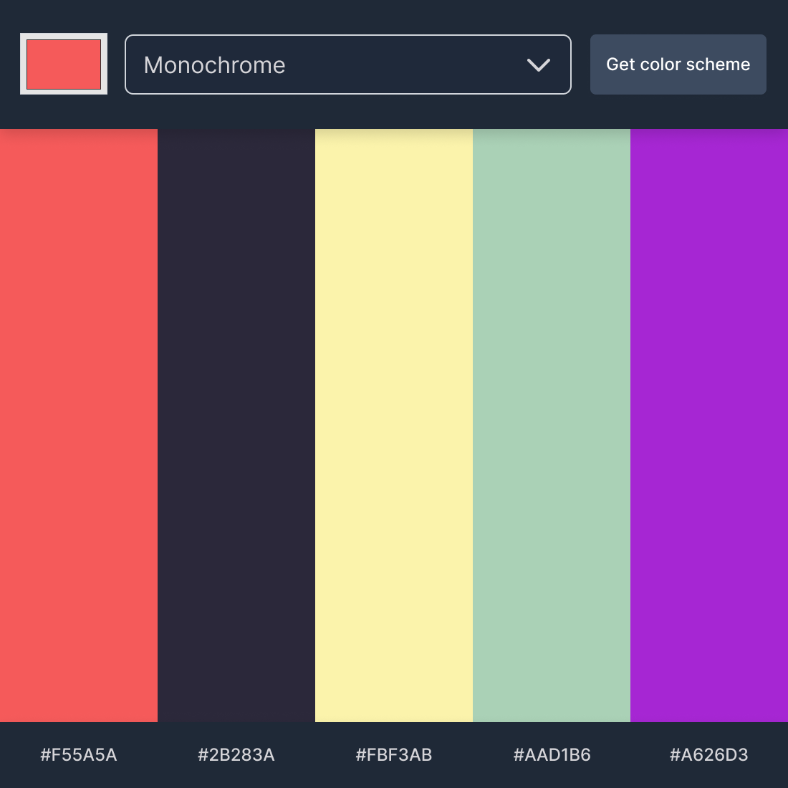

# Color Scheme Generator

## About 

Color Scheme Gernator is a frontend project involving the [COLOR API](https://www.thecolorapi.com/docs#schemes)

The main goal of this project is to involve myself with Restfull Api's, We can GET request from Api by providing the usefull information like `https://www.thecolorapi.com/scheme?hex=${myColor}&mode=${myModeValue}&count=5`. Api can recived request and send us back response in the form of JSON. by using fetch APi we can retrived useful information and use it in front end project.

In the above url we have provided Color, mode, and count to the api and in result we can get many information and usually a color schem in different 5 arrays with all of the colors.

## Usage 

First choose the color you want to have a generated color scheme, then just click on Get color scheme and you can see the color palette on the screen, if you want, click on the color code to copy it to the clipboard.

> Colors are the smiles of nature. (Leigh Hunt)

## Here is the project web view. **[LIVE](https://www.thecolorapi.com/docs#schemes)**
